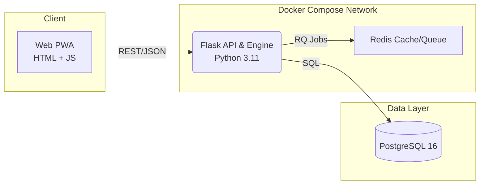

# GymGenius — System Architecture

> Last updated: 2025-06-14

## 1 Bird-Eye Diagram



## 2 Service Registry (machine-readable)

```jsonc
{
  "services": [
    {
      "name": "web",
      "path": "webapp",
      "lang": "javascript",
      "port": 8000,
      "depends_on": ["engine"]
    },
    {
      "name": "engine",
      "path": "engine",
      "lang": "python",
      "port": 5000,
      "depends_on": ["postgres", "redis"]
    }
  ],
  "datastores": [
    { "name": "postgres", "type": "sql", "image": "postgres:16-alpine" },
    { "name": "redis", "type": "key-value", "image": "redis:alpine" }
  ]
}
```

Agents can parse this JSON to auto-map folder names to Docker services.

## 3 Data-Flow Cheat-Sheet

| Path              | Payload                          | Notes                 |
| ----------------- | -------------------------------- | --------------------- |
| `web → engine`    | REST/JSON (`/v1/...`)            | JWT auth (planned)    |
| `engine → postgres` | SQL                             | psycopg2 driver       |

## 4 Key Tech Decisions (TDR links)

* **Monorepo** until MAU > 50 k → TDR-001
* **Postgres** over Mongo for relational complexity → TDR-002
* **Docker Compose** in dev; AWS ECS Fargate in production (Phase 4+) → TDR-003

(TDR docs live in `docs/tdr/`.)

## 5 Runtime Envs

| Environment | URL                             | Authentication   | Deploy Trigger      |
| ----------- | ------------------------------- | ---------------- | ------------------- |
| Local       | `localhost:*`                   | none             | `make dev`          |
| Local-Staging | `localhost` ports | none | `docker compose -f docker-compose.staging.yml up` |
| Production (Phase 4+) | `https://app.gymgenius.app` | Auth0 prod | GitHub Release `v*` |

## 6 Scaling Plan

1. **Vertical**: bump container CPU/RAM (target P99 < 150 ms).
2. **Read Replicas**: Postgres --> Aurora Serverless v2.
3. **Service Split**: if `engine` CPU > 70 %, move to GPU node pool.

*End of file*
