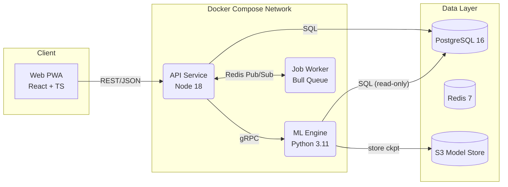

# GymGenius — System Architecture

> Last updated: 2025-06-14

## 1 Bird-Eye Diagram



## 2 Service Registry (machine-readable)

```jsonc
{
  "services": [
    {
      "name": "web",
      "path": "apps/web",
      "lang": "typescript",
      "port": 3000,
      "depends_on": ["api"]
    },
    {
      "name": "api",
      "path": "apps/api",
      "lang": "typescript",
      "port": 4000,
      "depends_on": ["postgres", "redis", "engine"]
    },
    {
      "name": "engine",
      "path": "services/engine",
      "lang": "python",
      "port": 5000,
      "depends_on": ["postgres", "s3"]
    },
    {
      "name": "worker",
      "path": "services/worker",
      "lang": "typescript",
      "queue": "bull",
      "depends_on": ["redis", "postgres"]
    }
  ],
  "datastores": [
    { "name": "postgres", "type": "sql", "image": "postgres:16" },
    { "name": "redis", "type": "cache", "image": "redis:7" },
    { "name": "s3", "type": "object_storage", "provider": "minio" }
  ]
}
```

Agents can parse this JSON to auto-map folder names to Docker services.

## 3 Data-Flow Cheat-Sheet

| Path              | Payload                          | Notes                 |
| ----------------- | -------------------------------- | --------------------- |
| `web → api`       | REST/JSON (`/workouts`, `/sets`) | JWT auth              |
| `api → engine`    | gRPC (`PredictSet` req/resp)     | \~5 ms avg            |
| `api ⇆ redis`     | Pub/Sub `workout_logged`         | Triggers worker jobs  |
| `worker → engine` | CLI `train.py --days=1`          | Nightly fine-tune     |
| `engine → s3`     | `model-{date}.pth`               | Versioned checkpoints |
| `api → postgres`  | CRUD                             | Prisma ORM            |

## 4 Key Tech Decisions (TDR links)

* **Monorepo** (`pnpm workspace`) until MAU > 50 k → TDR-001
* **Postgres** over Mongo for relational complexity → TDR-002
* **Redis** chosen for both cache and queue broker → TDR-003
* **Docker Compose** in dev; AWS ECS Fargate in production (Phase 4+) → TDR-004

(TDR docs live in `docs/tdr/`.)

## 5 Runtime Envs

| Environment | URL                             | Authentication   | Deploy Trigger      |
| ----------- | ------------------------------- | ---------------- | ------------------- |
| Local       | `localhost:*`                   | none             | `make dev`          |
| Local-Staging | `localhost` ports | none | `docker compose -f docker-compose.staging.yml up` |
| Production (Phase 4+) | `https://app.gymgenius.app` | Auth0 prod | GitHub Release `v*` |

## 6 Scaling Plan

1. **Vertical**: bump container CPU/RAM (target P99 < 150 ms).
2. **Read Replicas**: Postgres --> Aurora Serverless v2.
3. **Service Split**: if `engine` CPU > 70 %, move to GPU node pool.

*End of file*
